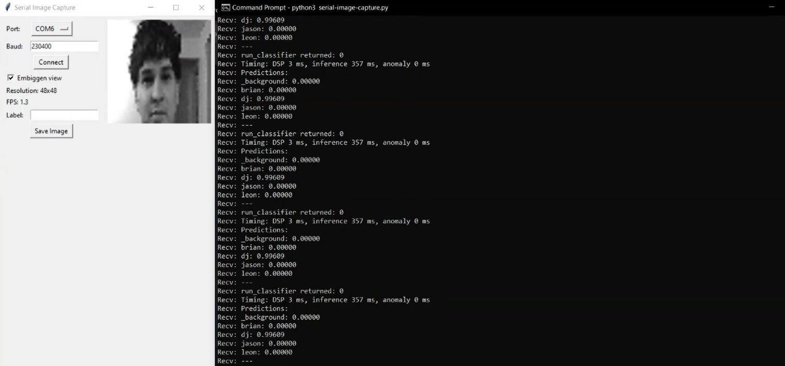

[](https://classroom.github.com/open-in-codespaces?assignment_repo_id=16838356)

# TinyFaces Final Report

## Team Name: 
Head Hunters

## Team Members:
- Jason Nguyen
- Brian Boner
- Leon Vaughan
- DJ Veliadis

## Introduction and Setup
The goal of this project is to implement a successful face detection AI model that is able to process a person’s face and correctly identify them. The project involves capturing training data, processing it through a tailored pipeline, and deploying a trained model to enable the Arduino system to recognize each of the four group members, as well as just the background (no members present). In order to do this, we taped the Arduino board to a certain elevation on a wall and placed a chair directly in front of it such that each group member could sit face-level with the camera. With the objective of having an algorithm that correctly identifies each member’s face regardless of their facial positioning, ten photos of each member were taken at five different facial profiles: up, down, left, right, and center. The name of each profile is the direction at which the group member is facing when the photos are taken, for instance the right profile is when the group member is looking to the right of the camera as opposed to directly at the camera. The hope of constructing a training dataset with multiple photos at different positions was to create an algorithm that continually correctly identifies each group member in real time without them having to face directly into the camera, as that would be a very limited algorithm for practical purposes. Thus, each group member had fifty photos in total taken of them and added to the training dataset, with each member’s name being used as their unique label to allow the algorithm to rightfully categorize them. Additionally, determining whether the algorithm could differentiate between actual faces and no faces present was a key concern, so various images of everyday objects and backgrounds were taken and added to the training dataset with the label “_background.” A properly functioning facial detection system should be able to distinguish between the target (faces) and the surrounding environment, thus this was an important step to validating our algorithm. What must be noted is that during the collection of the training dataset, all photos were taken during the daytime with the natural sunlight lighting the apartment in which they were taken. Understanding this is important, as the lighting of the room during testing would directly impact results. 

We used the Arduino Nano 33 BLE Sense Board and the OV7675 camera from the Arduino TinyML kit. 
 

To complete this project, we used multiple free software tools.
- [Arduino IDE][arduino_website] (Follow instructions to download)
- [Google Colab][colab_website] (Requires free google account)
- [Edge Impulse][impulse_website] (Create free account to use)
- [Python](https://www.python.org/downloads/) (We used Python v3.12.7)
- Python Pillow and pyserial packages (run installation command in command prompt/terminal)

```shell
python3 -m pip install Pillow pyserial
```

> If you do not have pip installed, you will need to [install it](https://pip.pypa.io/en/stable/installation/).

To follow along with the project, you will need to download the files below and save them within the same folder. 
- [Serial Communication with OV7675 camera](examples/Arduino_OV767X.zip)
- [Arduino Image Capture](examples/nano33_tinyml_kit_image_serial.ino)
- [Base64 Image Data Format](examples/base64.h)
- [Python Image Capture](examples/serial-image-catpure.py)
- [Data Augmentation Jupyter Notebook](examples/ei-image-augmentation.ipynb)
- [Live Image Classification](examples/nano33_camera_live_inference.ino)

## Image Capture
To train the model to recognize your faces, you need to capture images of your faces on the OV767X camera. You can use the following files to do so:
- [Serial Communication with OV7675 camera](examples/Arduino_OV767X.zip)
- [Arduino Image Capture](examples/nano33_tinyml_kit_image_serial.ino)
- [Base64 Image Data Format](examples/base64.h)
- [Python Image Capture](examples/serial-image-catpure.py)

After these files are downloaded, make sure they are all in the same folder. 
Open the Arduino IDE. In the Arduino IDE, **Sketch > Include Library > Add .ZIP Librar...**. Select **Arduino_OV767X.zip** file. This library is required for the Arduino Nano 33 BLE Sense to communicate with the camera on the TinyML kit.

Next, go to **File > Open...** and open the sketch **(YourFilePath)/nano33_tinyml_kit_image_serial.ino**. This file will capture, scale and crop the image and output it as Base64 data. 

Plug the Arduino Nano 33 BLE Sense board into your computer and make sure the board/port show up in the IDE

Compile and upload the sketch to the board (**Sketch > Upload**).
You should see "Done" if your program uploaded successfully.

Open a terminal or command prompt window and navigate to the directory that contains the Python Serial Image Captrue script. Example (windows):

```shell
chdir Downloads/tinyml-project/
```

Install [PySerial](https://pyserial.readthedocs.io/en/latest/) and [Pillow](https://pillow.readthedocs.io/en/stable/) Python packages if you have not already done so

```shell
python3 -m pip install Pillow pyserial
```

Run the [Serial Image Capture Python](examples/serial-image-catpure.py) script:

```shell
python3 serial-image-capture.py
```

> **Troubleshooting**
> If you see an error like `No module named '_tkinter'`, it means that (for some reason) Python was not installed with the tkinter package. You will need to install it with `brew install python-tk` (macOS), `python3 -m pip install tk` (Windows and Linux).

From the **Port** drop-down menu, select the serial port associated with your Arduino board (check with the Arduino IDE to verify the port).

Press **Connect**. You should see a live view of the Arduino camera. Click *Embiggen view* to make the image bigger. Due to the slow nature of converting and transmitting raw image data over a serial connection, do not expect more than a few frames per second.


Now, setup the camera such that only your face is visible in the live view of the Arduino camera. Enter your name in the box next to *Label* to set the label of the image to your name. Click **Save Image** to save the image to the directory that the Python script is in. Capture at least 50 images, slightly altering where you appear in the frame and how your head is oriented to create as full of a dataset as possible. Repeat this process for each person that you want to identify (try to keep the number of different people small).


Capture at least 50 images of the background with the label *_background* so the model can recognize when a face does not appear within the frame. 

After all images are captured, add them to a single .zip file. In Windows you can do this by highlighting all of your image files and Right-Clicking **Send to > Compressed (zipped) folder** name the .zip file **dataset.zip**. 

## Data Augmentation (Optional)
If you are not able to capture enough data to train the model, you can alter each image to create a larger dataset. To do this, you can use the provided [jupyter notebook](examples/ei-image-augmentation.ipynb). 

Once you have the notebook downloaded, open [Google Colab](colab_website)

Run the first code cell (press **shift + enter** to run cells) to install Node.js. You might see a pop-up warning you that the Notebook is not authored by Google. Click **OK**.

While that cell is running, click on the *folder* icon on the left-side pane to open the file browser pane. Right-click (or click the *upload* icon) to upload a file to the Notebook. Select your **dataset.zip** and click **Open**. This will upload your original dataset.

Go to [edgeimpulse.com](https://edgeimpulse.com/). Create an account if you have not already done so. Click **Login** and click **Create new project**.

Click on **Dashboard** and click on the **Keys** tab. Double-click to highlight the entire API key and copy it (don't worry if you can't see the whole key, it will be copied).


Go back to the Google Colab script. Continue running cells until you get to the `### Settings` cell. Overwrite the value of the `EI_API_KEY` string with the API key you copied from your project.

Continue running cells. The script performs the following actions:

 * Extracts your *dataset.zip* into the */content/dataset/* folder
 * Generates new images based on each original image: flipped, rotated, zoomed, translated, noise added
 * Zips the new dataset (including augmentations) into *out-augmented.zip* if you would like to download it
 * Uploads the full dataset to Edge Impulse, automatically splitting between training and test sets

If you head to the *Data acquisition* page in your Edge Impulse project, you should see your fully augmented dataset split between the *Training data* and *Test data* tabs.

## Model Training
To train the model, we used Edge Impulse, which is a free AI development platform. Edge Impulse makes it easy to create an AI model that can be added to the Arduino Nano 33 BLE Sense board. In the data augmentation section, we provided a Jupyter notebook that added the dataset to an edge impulse project. 

If you collected enough data to skip the data augmentation section, you will need to create a new [Edge Impulse](impulse_website) project. If you do not already have an account, you can create one for free. 

To upload your images to Edge Impulse, put them all in a single folder. Navigate to **Data Acquisition** and click on the *Upload Data* button. Select *Select a folder* for **Upload mode**, *Automatically split between training and testing* for **Upload into category**, and *Infer from filename* for **Label**. Next click on *choose files* and select the folder with your images. Finally, select **Upload Data** to upload your images. 


> **Note**
> The Python script that we used to capture images automatically saved each image to a file with the file name as the label followed by a unique id, which allows for Edge Impulse to label each image accurately based on the filename.

Go to your project in Edge Impulse. Go to the **Impulse design** page. Change the *Image data* resolution to be:

 * Image width: **48**
 * Image height: **48**
 * Resize mode: **Fit shortest**

Click **Add a processing block** and add the **Image** block. Click **Add a learning block** and select the **Classification** block.


Click on **Image** under *Impulse design*. Change the *Color depth* to **Grayscale**. 

Click **Save parameters** and click **Generate features** on the next page. Wait while Edge Impulse generates the training features from your dataset.


When feature extraction is complete, you should see a 2D feature explorer showing the relative separation among the class groupings along with an estimation of the time and resources required to perform feature extraction on your target device (default: Arm Cortex-M4F).


Click on **Classifier** under *Impulse design*. Change the *Number of training cycles* (epochs) to **100**. Leave everything else as default. Click **Start training**.


Go to the **Model testing** page and click **Classify all**. This will perform inference on your test dataset and display the results.


Navigate to the **Deployment** page in your project. In the search bar, enter **Arduino** and select the **Arduino library** option.

Scroll down to the bottom of the page. Leave the [EON Compiler](https://www.edgeimpulse.com/blog/introducing-eon) enabled. Leave *Quantized (int8)* selected. Click **Build**.

When the build process is complete, you should have an Arduino library (in .zip format) automatically downloaded to your computer. This library includes the fully trained model.


## Setup Live Image Classification
Next, we set up the Arduino Nano 33 BLE Sense board to be able to perform live image classification of our faces.

If you have not already, download the [Arduino Live Image Classification](examples/nano33_camera_live_inference.ino) program make sure the [Base64](examples/base64.h) file is in the same folder.

Open the Arduino IDE then open the Live Image Classification script **File > Open** and navigate to the program on your computer. 

You will need to import the Edge Impulse library. Select **Sketch > Include Library > Add .ZIP Library**. Select the library that you downloaded from Edge Impulse and click **Open**.

Open **File > Examples > \<NAME_OF_LIBRARY\> > nano_ble33_sense > nano_ble33_sense_camera**. Copy the `#include` line for your library.

Replace the `#include <head-hunters_inferencing.h>` line in the live classification script with your `#include` line. 

Compile and upload the sketch to your board.

> **Note**
> This step may take a long time to complete.

Once the sketch is uploaded to your board, run the python serial image capture script again.
```shell
python3 serial-image-capture.py
```

Select the port of your Arduino board and click **Connect**. The viewer will show you what the Arduino sees. Use the same setup as you did for image collection and get in front of the OV767 camera. The terminal window should have the printed inference results. The values correspond to the prediction scores -- the highest prediction score is the classification result. 



## Testing and Results

### Testing

To evaluate our Facial Detection AI, each group member sat in front of the Arduino camera and allowed the AI to scan and attempt to identify the person in the frame. Additionally, we tested the AI when no one was in the frame to ensure it would properly classify the image as "_background." During testing, we varied several conditions, including the distance from the camera, the number of people in the frame, and the room's lighting.

### Results

Overall, our model successfully identified the correct person about 75% of the time. While this accuracy is decent, it is not optimal. We identified several factors that may have contributed to the lower success rate. 

Lighting was a significant factor. The room we tested in had three lamps, providing eight combinations of light sources. Since our images were grayscale, lighting greatly affected how the model identified individuals in the frame. Another issue was that some individuals changed their appearance between training and testing, such as different hairstyles or wearing glasses. 

We trained the model on 50 images per person at five different angles: front, left, right, up, and down. The limited number of images per classification likely hindered the model's ability to distinguish between different people. Though fifty images does not seem like a negligible amount, the manner in which these photos were taken is quite flawed. By taking a burst of ten photos at each position, with little to no variation between each photo since they're taken together so rapidly, the model is essentially being fed just one photo at each angle (5 photos in total). Having a great number of essentially the same photo does not improve the algorithm. Instead, it would have been wise to take a multitude of photos while each group member's face is circling in motion, which would provide numerous angles and unique images as opposed to repeated stagnant ones. 

These are the main challenges we identified that led to the lower success rate of our model. For future models, we recommend increasing the number of training images with varied lighting, subject appearances, and facial angles. This approach would provide a much larger training dataset, potentially resulting in a higher success rate. 

[arduino_website]:https://www.arduino.cc/en/software
[colab_website]:https://colab.research.google.com/
[impulse_website]:https://edgeimpulse.com/
